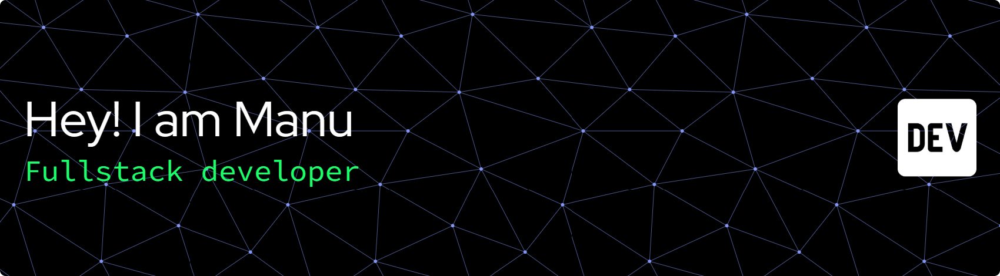

<!-- Encabezado principal -->
<h1 align="center">¡Hola! Soy Manu 👋</h1>

<!-- Descripción breve -->

  Software developer | Blockchain engernieer 🚀

<!-- Imagen de banner (opcional)

  

-->

<!-- Sección de acerca de mí -->
<h2>Sobre mí :smiley:</h2>

  🎓 De los viajes al código: un graduado en Turismo que conquistó el mundo del Desarrollo Web

💻 Mi viaje comenzó con una sólida formación en tecnologías como HTML, CSS, JavaScript y, especialmente, Angular, donde desarrollé varios proyectos que me ayudaron a afianzar mis habilidades en el frontend.

🚀 Durante el último año, me sumergí en el ecosistema de React y Node.js, trabajando en el desarrollo e implementación de la plataforma Backstage, una solución innovadora que me permitió ampliar mis conocimientos en el desarrollo full-stack.

🔄 Ahora, vuelvo a trabajar en proyectos con Angular, redescubriendo su potencial y aplicando lo aprendido en mi experiencia previa para crear aplicaciones aún más sólidas y eficientes.

<!-- Habilidades con iconos -->
<h2 align="center">Habilidades</h2>

<!-- Fila superior -->

  

<!-- Segunda fila -->

  

<!-- Tercera fila -->

  

<!-- Cuarta fila -->

  

<!-- Quinta fila -->

  

<!-- Sexta fila -->

  

  

<!-- Sección de proyectos destacados -->
<h2>Proyectos Destacados</h2>
<ul>
  <li>
    <strong>Proyecto 1:</strong> <a href="https://asstrom.es/home">asstrom</a>
     
    Portafolio web desarrolldo en Angular. Incluye varias conexiones a API como la de wheaterapp, mapbox y restcountries.
    Ademas incluye una aplicacion de tareas, un login y registro. Todo ello jugando con el localstorage y el sessionstorage.
  </li>
</ul>

<!-- Sección de contacto -->
<h2>Contacto</h2>

  Si deseas ponerte en contacto conmigo, puedes encontrarme en:
  <ul>
    <li><a href="https://www.linkedin.com/in/josemanuelmosqueteabreu/">LinkedIn</a></li>
    <li><a href="jmma1995@gmail.com">Correo Electrónico</a></li>
  </ul>

<!-- Iconos de redes sociales (opcional) -->

  
  

